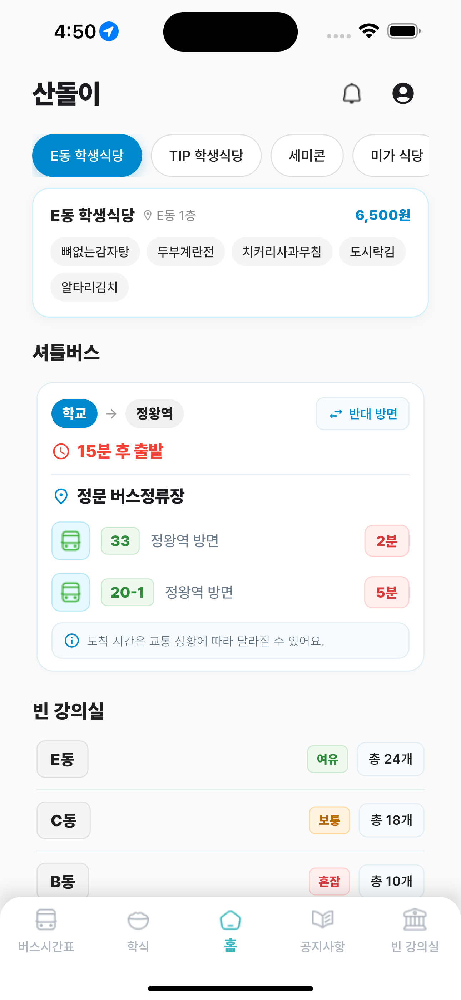
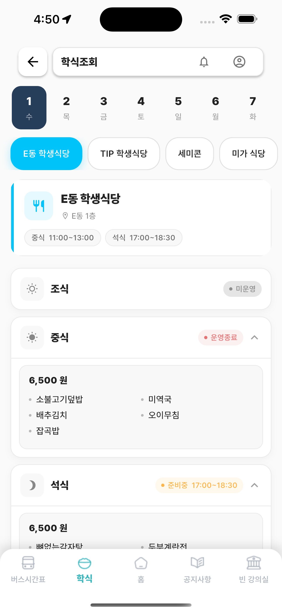
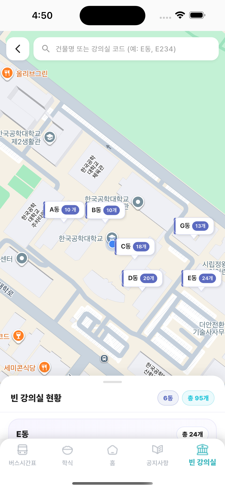
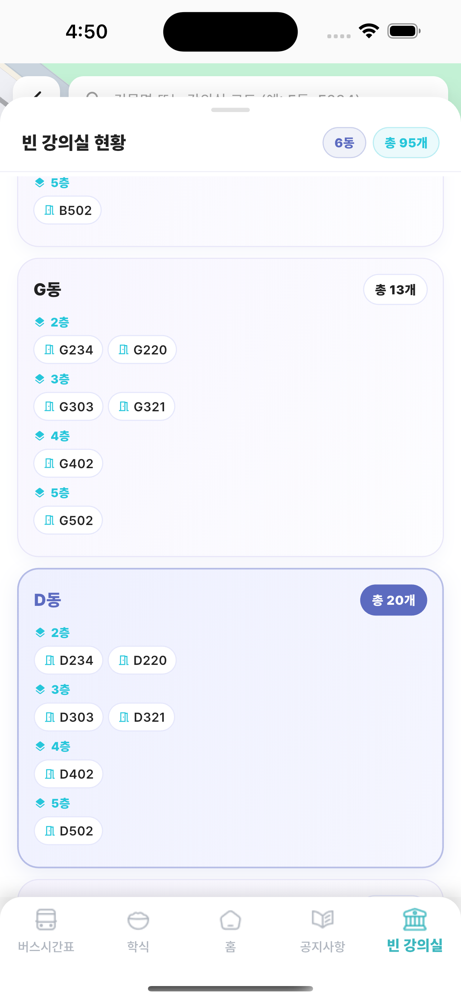
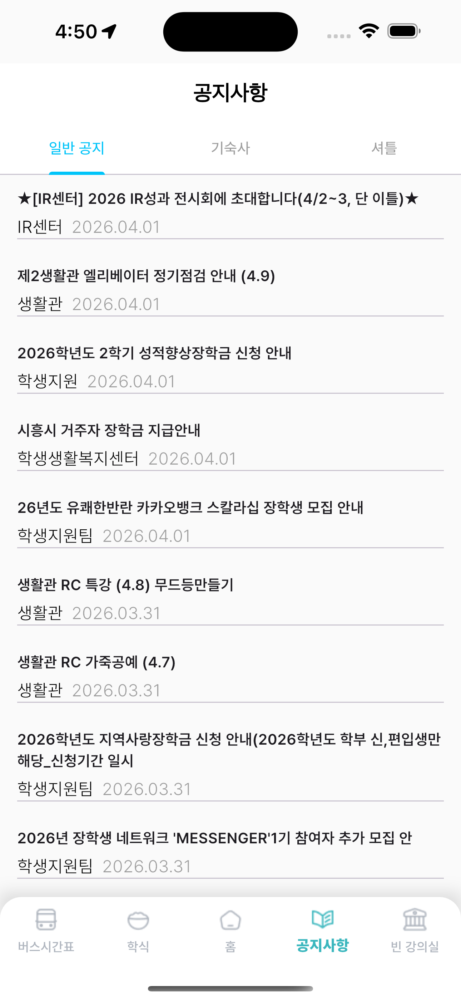

# Sandori (산돌이)

**한국공학대학교 학생들을 위한 캠퍼스 생활 정보 앱**
 
---

## 🛠️ 개발 아키텍처

### 아키텍처: Feature-First + 3-Layer

기능별 모듈 단위로 코드를 분리하고, 각 기능 안에서 data / domain / presentation 3계층을 유지합니다.

- `presentation` → `domain` 참조 허용
- `presentation` → `data` (DTO 직접 참조) 금지
- feature 간 직접 참조 금지 → 공유 시 `shared/`로 추출

### 상태관리: Riverpod (코드 생성 방식)

`@riverpod` 어노테이션만 사용. `StateProvider`, `StateNotifierProvider` 등 수동 선언 금지.

### 네트워킹: Retrofit + Dio

`@RestApi` 인터페이스로 API 선언. Dio는 `keepAlive: true` 싱글톤, 인터셉터 순서: Auth → Error → Logging.

- **메인 API** (`dio_provider.dart`): `http://127.0.0.1:3000`
- **Static-Info API** (`static_info_dio_provider.dart`): 로컬 `http://127.0.0.1:5600` / Docker `http://127.0.0.1:8000`

### 라우팅: GoRouter

`context.go()` / `context.push()` 만 사용. `Navigator.push()` 직접 사용 금지.

### 코드 생성 도구

| 역할 | 패키지 |
|---|---|
| JSON 직렬화 | `json_serializable` + `json_annotation` |
| API 클라이언트 | `retrofit_generator` |
| 상태관리 | `riverpod_generator` |
| 불변 모델 | `freezed` |

```bash
dart run build_runner build --delete-conflicting-outputs
```

---

## 📂 디렉토리 구조

```
lib/
├── main.dart                          # 앱 진입점, GetIt DI 설정, ProviderScope
│
├── const/
│   └── colors.dart                    # 앱 공통 색상 상수
│
├── core/                              # 앱 전역 인프라
│   ├── constants/
│   │   └── api_constants.dart         # baseUrl, staticInfoBaseUrl 등 API 상수
│   ├── network/
│   │   ├── dio_provider.dart          # 메인 API Dio 싱글톤 프로바이더
│   │   └── static_info_dio_provider.dart  # Static-Info API 전용 Dio 프로바이더 
│   ├── router/
│   │   ├── app_router.dart            # GoRouter 설정
│   │   └── route_paths.dart           # 경로 상수
│   └── utils/
│       └── date_formatter.dart        # ISO 8601 → yyyy.MM.dd 포맷터
│
├── common/                            # feature 간 공통 UI / 공유 레이어
│   ├── layout/
│   │   ├── default_layout.dart        # 공통 Scaffold 래퍼 (AppBar·SafeArea 옵션)
│   │   └── root_tab.dart              # 바텀탭 셸 (IndexedStack + PopScope)
│   ├── component/
│   │   ├── app_bottom_nav.dart        # 바텀 네비게이션 바
│   │   ├── header_text.dart           # 섹션 헤더 텍스트 + 더보기 버튼
│   │   ├── selectable_icon_button.dart # 선택형 원형 아이콘 버튼
│   │   └── top_bar.dart               # 상단바 (앱 이름, 알림, 프로필)
│   └── repository/
│       └── static_repository.dart     # 학식·버스·배너 정적 Mock 데이터
│
├── features/                          # 기능별 모듈
│   │
│   ├── home/                          # 홈 화면
│   │   ├── component/
│   │   │   └── banner_card_top.dart   # 자동 스크롤 배너 캐러셀
│   │   ├── model/
│   │   │   └── banner_model.dart
│   │   └── screen/
│   │       ├── home_screen.dart       # 홈 (학식·빈강의실·버스 요약 + 조직도 진입 )
│   │       └── splash_screen.dart     # 스플래시 (2초 후 gate 이동)
│   │
│   ├── bus/                           # 버스 시간표
│   │   ├── component/
│   │   │   └── bus_time_card.dart     # 홈용 버스 정보 카드 (ConsumerWidget, 동적 이미지 )
│   │   ├── data/                      # Static-Info API 연동
│   │   │   ├── data_source/
│   │   │   │   └── bus_image_api.dart         # @RestApi BusImageApi
│   │   │   ├── dto/
│   │   │   │   ├── bus_image_response.dart    # 단일 이미지 URL DTO
│   │   │   │   └── bus_images_response.dart   # 이미지 URL 목록 DTO
│   │   │   └── repository/
│   │   │       └── bus_image_repository_impl.dart
│   │   ├── domain/
│   │   │   └── repository/
│   │   │       └── bus_image_repository.dart  # abstract Repository
│   │   ├── model/
│   │   │   └── bus_model.dart
│   │   ├── presentation/
│   │   │   └── provider/
│   │   │       └── bus_image_provider.dart    # busImagesProvider (@riverpod) 
│   │   └── screen/
│   │       └── bus_time_detail_screen.dart    # 버스 상세 + 구글맵 (ConsumerStatefulWidget )
│   │
│   ├── school_meal/                   # 학식·식당
│   │   ├── component/
│   │   │   └── meal_card.dart         # 홈용 학식 리스트 카드
│   │   ├── model/
│   │   │   ├── meal_model.dart
│   │   │   └── meals_ranking_model.dart
│   │   └── screen/
│   │       └── restaurant_detail_screen.dart  # 학식 상세 + 인기 학식 랭킹
│   │
│   ├── empty_class/                   # 빈 강의실
│   │   ├── component/
│   │   │   └── empty_class_card.dart  # 홈용 빈 강의실 카드
│   │   ├── model/
│   │   │   └── class_model.dart       # EmptyClass
│   │   ├── repository/
│   │   │   └── empty_class_repository.dart  # abstract + FakeMock 구현체
│   │   └── screen/
│   │       └── empty_detail_screen.dart     # 구글맵 + SlidingUpPanel
│   │
│   ├── notice/                        # 공지사항 (3-Layer 완성)
│   │   ├── data/
│   │   │   ├── data_source/
│   │   │   │   └── notice_api.dart            # @RestApi Retrofit 인터페이스
│   │   │   ├── dto/
│   │   │   │   ├── notice_item_response.dart
│   │   │   │   ├── paginated_notice_response.dart
│   │   │   │   ├── shuttle_item_response.dart
│   │   │   │   ├── paginated_shuttle_response.dart
│   │   │   │   └── shuttle_recent_response.dart
│   │   │   └── repository/
│   │   │       └── notice_repository_impl.dart
│   │   ├── domain/
│   │   │   ├── model/
│   │   │   │   ├── notice.dart
│   │   │   │   ├── shuttle.dart
│   │   │   │   └── shuttle_recent.dart
│   │   │   └── repository/
│   │   │       └── notice_repository.dart     # abstract Repository
│   │   └── presentation/
│   │       ├── page/
│   │       │   ├── notice_page.dart           # 탭(일반/기숙사/셔틀) 목록
│   │       │   └── notice_detail_page.dart    # WebView 상세
│   │       ├── provider/
│   │       │   └── notice_provider.dart       # @riverpod Notifier
│   │       └── widget/
│   │           ├── notice_card.dart
│   │           └── shuttle_card.dart
│   │
│   ├── organization/                  # 학과·부서 조직도 
│   │   ├── data/
│   │   │   ├── data_source/
│   │   │   │   └── organization_api.dart      # @RestApi OrganizationApi
│   │   │   ├── dto/
│   │   │   │   ├── organization_group_response.dart    # 그룹 노드 DTO
│   │   │   │   ├── organization_node_raw_response.dart # 통합 DTO (group+unit)
│   │   │   │   └── organization_unit_response.dart     # 단위 노드 DTO
│   │   │   └── repository/
│   │   │       └── organization_repository_impl.dart
│   │   ├── domain/
│   │   │   ├── model/
│   │   │   │   └── organization_node.dart     # sealed class (GroupNode / UnitNode)
│   │   │   └── repository/
│   │   │       └── organization_repository.dart  # abstract Repository
│   │   └── presentation/
│   │       ├── page/
│   │       │   ├── organization_tree_page.dart   # 조직도 트리 (검색바 + ExpansionTile)
│   │       │   └── organization_search_page.dart # 검색 결과 페이지
│   │       ├── provider/
│   │       │   └── organization_provider.dart    # OrganizationTreeNotifier, SearchNotifier
│   │       └── widget/
│   │           └── organization_node_card.dart   # sealed class switch → GroupTile / UnitTile
│   │
│   └── auth/                          # 인증·로그인
│       └── screen/
│           ├── sign_in_gate_screen.dart  # 시작 게이트 화면
│           ├── login_screen.dart         # 로그인
│           └── signin_screen.dart        # 회원가입
│
└── shared/                            # feature 간 공유 모델·위젯
    ├── model/
    │   └── pagination_state.dart      # @freezed PaginationState<T>
    └── widget/
        └── full_screen_image_viewer.dart  # InteractiveViewer 전체화면 이미지
```

### 바텀 네비게이션 탭 순서

| 인덱스 | 탭 | 화면 |
|---|---|---|
| 0 | 버스시간표 | `BusTimeDetailScreen` |
| 1 | 학식 | `RestaurantDetailScreen` |
| **2** | **홈 (중앙)** | **`HomeScreen`** |
| 3 | 공지사항 | `NoticePage` |
| 4 | 빈 강의실 | `EmptyDetailScreen` |

### 라우트 목록

| 경로 | 화면 |
|---|---|
| `/splash` | `Splashscreen` |
| `/gate` | `SignInGateScreen` |
| `/login` | `Loginscreen` |
| `/login/sign-in` | `Signinscreen` |
| `/main` | `RootTab` |
| `/notice-detail` | `NoticeDetailPage` |
| `/organization` | `OrganizationTreePage`  |
| `/organization/search` | `OrganizationSearchPage`  |


## 🌐 Static-Info API 연동

`sandol-static-info-service` (FastAPI) 와 연동합니다.

| 환경 | URL |
|---|---|
| 로컬 (uvicorn) | `http://127.0.0.1:5600` |
| Docker | `http://127.0.0.1:8000` |

> **주의**: 로컬 실행 시 API 경로에 `/static-info/` prefix 없음.
> Docker 사용 시 `api_constants.dart`의 `staticInfoBaseUrl`을 `http://127.0.0.1:8000`으로 변경하고
> 각 API 파일 경로에 `/static-info/` prefix를 추가해야 합니다.

### 연동된 엔드포인트

| 엔드포인트 | 기능 |
|---|---|
| `GET /bus/images` | 버스 아이콘 이미지 URL 목록 |
| `GET /bus/image/{index}` | 특정 인덱스 버스 이미지 |
| `GET /organization/tree` | 전체 조직도 트리 |
| `GET /organization/search/{name}` | 조직 이름 검색 |
| `GET /organization/{path}` | 특정 경로 조직 조회 |
| `GET /organization/{path}/children` | 하위 조직 목록 |

---
---
## 📱 스크린샷

<table>
  <tr>
    <td align="center">
      
      <br>홈 
    </td>
    <td align="center">
      
      <br>식단
    </td>
    <td align="center">
      
      <br>빈 강의실 
    </td>
  </tr>
  <tr>
    <td align="center">
      
      <br>빈 강의실 상세
    </td>
    <td align="center">
      
      <br>버스 시간표
    </td>
    <td align="center">
      
      <br>공지사항
    </td>
  </tr>
</table>


## 🎨 색상 팔레트

| 용도 | 색상값 |
|---|---|
| 메인 포인트 | `Color(0xFF00C4F9)` |
| 서브 포인트 | `Color(0xFF95E0F4)` |
| 배경 | `Colors.white` |
| 서브 배경 | `Color(0xFFFAFAFA)` |
| 텍스트 기본 | `Colors.black` / `Colors.black87` |
| 텍스트 보조 | `Colors.grey` |

> Flutter 기본 보라/파랑 계열(`Colors.blue`, `Colors.purple` 등) 사용 금지.
> `CircularProgressIndicator`, `TabBar`, `ElevatedButton` 등 기본값이 보라색인 위젯은 반드시 색상 지정.

---

## 📦 주요 의존성

```yaml
dependencies:
  flutter_riverpod: ^2.5.1
  riverpod_annotation: ^2.3.5
  dio: ^5.9.2
  retrofit: ">=4.6.0 <4.9.0"
  json_annotation: ^4.9.0
  freezed_annotation: ^2.4.4
  go_router: ^17.1.0
  flutter_secure_storage: ^10.0.0
  get_it: ^9.2.1
  google_maps_flutter: ^2.15.0
  geolocator: ^14.0.2
  sliding_up_panel: ^2.0.0+1
  webview_flutter: ^4.13.1

dev_dependencies:
  build_runner: ^2.4.13
  riverpod_generator: ^2.4.3
  retrofit_generator: ^9.0.0
  json_serializable: ^6.9.4
  freezed: ^2.5.7
```

---

## 🚀 설치 & 실행

```bash
# 저장소 클론
git clone https://github.com/SongsBy/Sandori.git

# 패키지 설치
flutter pub get

# 코드 생성
dart run build_runner build --delete-conflicting-outputs

# iOS 실행
flutter run -d ios

# Android 실행
flutter run -d android
```

---

## 🗺️ 향후 개발 계획

- 소셜 로그인 (Kakao / Google / Apple) — PKCE + state 파라미터 적용
- 실시간 API 연동 (학식 메뉴, 버스 시간표)
- `home/`, `school_meal/`, `empty_class/` → `notice`처럼 data/domain/presentation 3-Layer로 점진적 전환
- 푸시 알림 (공지사항, 셔틀 출발 알림)
